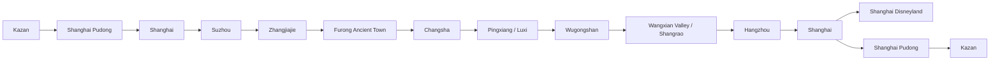

# Current State

This file records the current working state of the China trip. For detailed source context, see [RAW_CONTEXT.md](./RAW_CONTEXT.md).

## Current Route

# 3. Даты и общий маршрут

## Текущий каркас

| Дата | День | Регион | Главный смысл дня | Ночёвка |
|---|---:|---|---|---|
| 19.06.2026 | День 0 | Kazan → Shanghai | Вылет из Kazan | Самолёт |
| 20.06.2026 | День 1 | Shanghai | Прилёт, адаптация, отель/багаж, город | Shanghai, отель не подтверждён в доступных письмах |
| 21.06.2026 | День 2 | Suzhou → Zhangjiajie | Сады Suzhou, вечерний/ночной перелёт в Zhangjiajie | XIADUO Hotel, Zhangjiajie |
| 22.06.2026 | День 3 | Zhangjiajie | Tianmen Mountain, 72 Towers | Zhangjiajie, отель на 22–23 не подтверждён письмом |
| 23.06.2026 | День 4 | Zhangjiajie | Zhangjiajie National Forest Park | Zhangjiajie, отель на 23–24 не подтверждён письмом |
| 24.06.2026 | День 5 | Zhangjiajie → Furong | Glass Bridge, переезд, вечерний Furong | Twelve Cities / Furong hotel |
| 25.06.2026 | День 6 | Furong → Changsha → Pingxiang → Wugongshan | Ранний выезд, переезд, подъём к горной ночёвке | Pingxiang Wugong Mountain Meadow Star Tent House |
| 26.06.2026 | День 7 | Wugongshan → Wangxian | Рассвет/спуск, восстановление, переезд, Wangxian lighting | Yangxian Village, Wangxian Valley |
| 27.06.2026 | День 8 | Wangxian/Shangrao → Hangzhou | Утро/буфер, переезд, West Lake, чайный мягкий день | Haoiar Hotel, Hangzhou West Lake Lingyin Temple |
| 28.06.2026 | День 9 | Hangzhou → Shanghai? | Longjing / tea villages / West Lake; далее нужен точный переезд в Shanghai | Shanghai, отель не подтверждён |
| 29.06.2026 | День 10 | Shanghai | Shanghai Disneyland по календарю | Shanghai, отель не подтверждён |
| 30.06.2026 | День 11 | Shanghai | Открытый день / резерв / альтернатива Zhujiajiao | Shanghai, отель не подтверждён |
| 01.07.2026 | День 12 | Shanghai → Kazan | Вылет PVG → Kazan | Самолёт / Kazan |

## Главная логика маршрута

---

## Confirmed And Open Bookings

# 14. Отели и ночёвки

| Дата | Город | Отель | Статус | Оплата / стоимость | Проверить |
|---|---|---|---|---|---|
| 20–21.06 | Shanghai | Не найден в доступных письмах | Открыто | Нет данных в доступных письмах | Срочно подтвердить/забронировать |
| 21–22.06 | Zhangjiajie | XIADUO Hotel | Подтверждено | Цена не извлечена из-за обрезанного письма | Поздний заезд после 00:00 |
| 22–23.06 | Zhangjiajie | Не найден | Открыто | Нет данных | Нужна бронь/подтверждение |
| 23–24.06 | Zhangjiajie | Не найден | Открыто | Нет данных | Нужна бронь/подтверждение |
| 24–25.06 | Furong | Twelve Cities / former 12C | Подтверждено | 3 327,87 ₽ paid | Не перепутать новое название |
| 25–26.06 | Wugongshan | Pingxiang Wugong Mountain Meadow Star Tent House | Подтверждено | 6 155,19 ₽ paid | Scenic ticket, cableway before 17:00 |
| 26–27.06 | Wangxian | Yangxian Village, Wangxian Valley | Подтверждено | 9 333,65 ₽ paid | Included tickets, поздний заезд |
| 27–28.06 | Hangzhou | Haoiar Hotel | Подтверждено | 442 CNY pay at hotel + 4 814,45 ₽ guarantee | Возврат гарантии |
| 28–29.06 | Shanghai | Не найден | Открыто | Нет данных | Срочно |
| 29–30.06 | Shanghai | Не найден | Открыто | Нет данных | Срочно |
| 30.06–01.07 | Shanghai | Не найден | Открыто | Нет данных | Срочно, удобство к PVG |

---

## Tickets And Booking Work

# 16. Что нужно забронировать

## Срочно

- Shanghai hotel 20–21 June.
- Shanghai hotel 28 June–1 July или минимум 28–30 и 30–1.
- Hangzhou → Shanghai train for 28 June.
- Shanghai Disneyland ticket for 29 June.
- Проверить/купить Tianmen Mountain tickets.
- Проверить/купить Zhangjiajie National Forest Park tickets.
- Проверить/купить Glass Bridge tickets.
- Точные поезда Furong → Changsha → Pingxiang / Luxi.
- Транспорт Pingxiang/Luxi → Wugongshan.

## Можно позже, но до поездки

- Local taxis/transfers where unclear.
- SIM/eSIM if не решено.
- Insurance / offline copies.
- Резервные планы на дождь.

## Можно на месте

- Еда.
- Часть городских перемещений.
- Лёгкие Shanghai activities без строгих билетов.

## Нельзя оставлять на месте

- Горные отели и ночёвки.
- Disney ticket.
- Вход/канатки Wugongshan, если ограничены слотами.
- Zhangjiajie/Tianmen tickets в пиковый период.
- Последние ночи в Shanghai.

---

## Current Risks

# 21. Риски

| Риск | Где возникает | Вероятность | Последствия | Как снизить |
|---|---|---:|---|---|
| Нет Shanghai hotel | 20.06 и 28–01 | Высокая | Негде оставить багаж/ночевать | Срочно проверить Trip.com/почту/забронировать |
| Опоздание на cableway | Wugongshan 25.06 | Высокая | Пеший подъём после 17:00 | Сдвинуть переезд раньше, связаться с отелем |
| Слишком тяжёлый маршрут | 21–26.06 | Высокая | Усталость, срыв планов | Убрать лишние вечерние блоки, буферы |
| Дождь/туман | Zhangjiajie/Wugongshan | Средняя | Нет видов, скользко | Проверка погоды, дождевик, запас времени |
| Нет билетов | Tianmen/Disney/parks | Средняя | Срыв ключевых мест | Купить заранее |
| Китайские каникулы | Disney/parks | Средняя | Толпы | 29.06 до июля, ранний вход |
| Багаж в горах | Wugongshan | Высокая | Невозможно идти комфортно | Оставить большой багаж внизу |
| Неверный отель | Furong name changed | Средняя | Такси привезёт не туда | Использовать адрес + Trip.com current name |
| Поздний заезд | XIADUO/Wangxian | Средняя | Отказ/сложности | Написать заранее |
| Разница времени | Flights/calendar | Средняя | Ошибка расписания | Всегда указывать local time |
| Стёртые кроссовки | Весь маршрут | Высокая | Боль/травмы | Купить и разносить новую обувь |
| Языковой барьер | Вокзалы/такси/отели | Средняя | Потеря времени | Amap, Trip.com, адреса на китайском как backup |

---

## Technical Planning Debt

# 25. Технический долг планирования

- Нет подтверждённого Shanghai hotel 20–21 июня.
- Нет подтверждённого Shanghai hotel 28 июня–1 июля.
- Нет подтверждённых Zhangjiajie hotels 22–24 июня в доступных письмах.
- Нет найденного подтверждения внутреннего flight to Zhangjiajie.
- Нет точных train tickets Furong → Changsha → Pingxiang.
- Нет точного train ticket Shangrao/Wangxian → Hangzhou.
- Нет Hangzhou → Shanghai переезда 28 июня.
- Нет Disneyland ticket на 29 июня.
- Нет подтверждения Tianmen Mountain tickets.
- Нет подтверждения Zhangjiajie National Forest Park tickets.
- Нет Glass Bridge ticket.
- Не решён багаж на Wugongshan.
- Не подтверждено, как попасть в Wugongshan hotel после 17:00.
- Не проверен прогноз погоды на Zhangjiajie/Wugongshan/Wangxian.
- Не оформлен backup plan на дождь/туман.
- Не исправлен Disney timing: 13:00 плохо сочетается с Early Entry.

---

## Open Questions

# 26. Список открытых вопросов

| Вопрос | Почему важен | Что нужно сделать | Приоритет |
|---|---|---|---|
| Где ночевать в Shanghai 20–21? | Прилёт, багаж, старт маршрута | Найти/подтвердить бронь | Высокий |
| Где ночевать в Shanghai 28–01? | Disney и вылет PVG | Забронировать | Высокий |
| Где ночёвки Zhangjiajie 22–24? | После Tianmen и перед Furong | Проверить Trip.com/забронировать | Высокий |
| Куплен ли внутренний flight to Zhangjiajie? | Без него рушится 21–22 июня | Найти билет/купить | Высокий |
| Как попасть в Wugongshan hotel до закрытия cableway? | Критический риск | Связаться с отелем, пересобрать день | Высокий |
| Где оставить багаж перед Wugongshan? | Нельзя тащить 23 кг | Найти storage/отель/такси | Высокий |
| Купить ли Early Park Entry Pass? | Disney day quality | Проверить цену/доступность | Средний |
| Что делать 30 июня вместо Zhujiajiao? | Последний день | Выбрать Shanghai city plan | Средний |
| Нужен ли Dragon Boat plan? | Был интерес | Проверить дату/место актуально | Низкий/средний |
| Нужна ли термуха? | Wugongshan night | Проверить прогноз | Средний |

---
