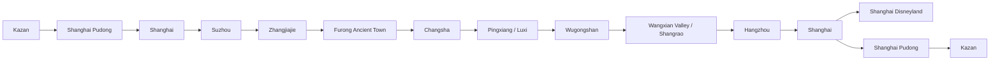

# Route

## Overall Route And Logic

# 3. Даты и общий маршрут

## Текущий каркас

| Дата | День | Регион | Главный смысл дня | Ночёвка |
|---|---:|---|---|---|
| 19.06.2026 | День 0 | Kazan → Shanghai | Вылет из Kazan | Самолёт |
| 20.06.2026 | День 1 | Shanghai | Прилёт, адаптация, отель/багаж, город | Shanghai, отель не подтверждён в доступных письмах |
| 21.06.2026 | День 2 | Suzhou → Zhangjiajie | Сады Suzhou, вечерний/ночной перелёт в Zhangjiajie | XIADUO Hotel, Zhangjiajie |
| 22.06.2026 | День 3 | Zhangjiajie | Tianmen Mountain, 72 Towers | Zhangjiajie, отель на 22–23 не подтверждён письмом |
| 23.06.2026 | День 4 | Zhangjiajie | Zhangjiajie National Forest Park | Zhangjiajie, отель на 23–24 не подтверждён письмом |
| 24.06.2026 | День 5 | Zhangjiajie → Furong | Glass Bridge, переезд, вечерний Furong | Twelve Cities / Furong hotel |
| 25.06.2026 | День 6 | Furong → Changsha → Pingxiang → Wugongshan | Ранний выезд, переезд, подъём к горной ночёвке | Pingxiang Wugong Mountain Meadow Star Tent House |
| 26.06.2026 | День 7 | Wugongshan → Wangxian | Рассвет/спуск, восстановление, переезд, Wangxian lighting | Yangxian Village, Wangxian Valley |
| 27.06.2026 | День 8 | Wangxian/Shangrao → Hangzhou | Утро/буфер, переезд, West Lake, чайный мягкий день | Haoiar Hotel, Hangzhou West Lake Lingyin Temple |
| 28.06.2026 | День 9 | Hangzhou → Shanghai? | Longjing / tea villages / West Lake; далее нужен точный переезд в Shanghai | Shanghai, отель не подтверждён |
| 29.06.2026 | День 10 | Shanghai | Shanghai Disneyland по календарю | Shanghai, отель не подтверждён |
| 30.06.2026 | День 11 | Shanghai | Открытый день / резерв / альтернатива Zhujiajiao | Shanghai, отель не подтверждён |
| 01.07.2026 | День 12 | Shanghai → Kazan | Вылет PVG → Kazan | Самолёт / Kazan |

## Главная логика маршрута

---

## City And Location Map

# 5. Карта городов и локаций

| Локация | Роль в маршруте | Статус | Комментарий |
|---|---|---|---|
| Shanghai | Вход/выход, Disney, город | Принято | Не хватает подтверждённых отелей в начале/конце |
| Suzhou | Сады перед перелётом в Zhangjiajie | Принято в календаре, но требует проверки | Насыщенный день с риском опоздания |
| Zhangjiajie | Avatar mountains, Tianmen, Glass Bridge | Принято | Есть отель только на 21–22 в доступных письмах |
| Furong Ancient Town | Вечерняя атмосферная остановка | Принято | Отель подтверждён, ранний выезд дальше |
| Wugongshan / Wugong Mountain | Главная горная кульминация | Принято, но рискованно | Нужно критически проверить cableway и прибытие |
| Wangxian Valley | Вечерняя подсветка после Wugongshan | Принято | Отель и билеты в пакете подтверждены |
| Hangzhou | Восстановление, чай, West Lake, Lingyin | Принято | Отель подтверждён на 27–28 |
| Zhujiajiao Ancient Town | Идея на 30 июня | Отклонено пользователем | “Не красивый” |
| Beijing | Старый якорь маршрута | Отклонено/архив | После Furong маршрут должен идти к Wugongshan и Shanghai |
| Chongqing | Рассматривался как добавление | Архив / под вопросом | В текущий маршрут не встроен |
| Longji Rice Terraces | Архивная красивая идея | Архив | Не стоит ломать маршрут ради Longji |
| OMG Heartbeat Park / Tonglu | Аттракционы около Hangzhou | Архив / опционально | Возможно только если освобождается день |

---

## Transport Backbone

# 13. Логистика и транспорт

| Дата | Откуда | Куда | Тип | Статус | Риски / что проверить |
|---|---|---|---|---|---|
| 19–20.06 | Kazan KZN | Shanghai PVG T1 | Flight MU-5066 | Подтверждено | Онлайн-табло, документы |
| 20.06 | PVG | Shanghai hotel | Metro/taxi | Календарь | Отель не подтверждён |
| 21.06 | Shanghai | Suzhou | Train/metro? | Календарь | Купить/подтвердить билеты |
| 21–22.06 | Shanghai/Suzhou area | Zhangjiajie | Flight | Календарь, билет не найден в Gmail | Аэропорт/багаж/время |
| 24.06 | Zhangjiajie | Glass Bridge | Local transport | Календарь | Билеты/багаж/время работы |
| 24.06 | Glass Bridge/Zhangjiajie | Furong | Bus/taxi/train? | Календарь | Точный транспорт не подтверждён |
| 25.06 | Furong | Changsha | Train | Календарь | Точный билет не найден |
| 25.06 | Changsha | Pingxiang | Train | Календарь | Пересадка 30 мин может быть рискованной |
| 25.06 | Pingxiang/Luxi | Wugongshan | Taxi/local bus | Календарь | Cableway closes 17:00 |
| 26.06 | Wugongshan | Wangxian / Shangrao | Train/taxi | Календарь | Неизвестная точная схема |
| 27.06 | Shangrao/Wangxian | Hangzhou | Train | Календарь | Купить/подтвердить билет |
| 28.06 | Hangzhou | Shanghai | Train | Не отражено явно | Критический разрыв перед Disney |
| 29.06 | Shanghai hotel | Disneyland | Metro/taxi | Нужна детализация | Ранний вход требует раннего старта |
| 01.07 | Shanghai | PVG T1 | Metro/taxi | Нужна детализация | Запас времени на международный вылет |
| 01.07 | Shanghai PVG | Kazan KZN | Flight MU-5065 | Подтверждено | Не перепутать местное время |

---

## Nights And Accommodation Chain

# 14. Отели и ночёвки

| Дата | Город | Отель | Статус | Оплата / стоимость | Проверить |
|---|---|---|---|---|---|
| 20–21.06 | Shanghai | Не найден в доступных письмах | Открыто | Нет данных в доступных письмах | Срочно подтвердить/забронировать |
| 21–22.06 | Zhangjiajie | XIADUO Hotel | Подтверждено | Цена не извлечена из-за обрезанного письма | Поздний заезд после 00:00 |
| 22–23.06 | Zhangjiajie | Не найден | Открыто | Нет данных | Нужна бронь/подтверждение |
| 23–24.06 | Zhangjiajie | Не найден | Открыто | Нет данных | Нужна бронь/подтверждение |
| 24–25.06 | Furong | Twelve Cities / former 12C | Подтверждено | 3 327,87 ₽ paid | Не перепутать новое название |
| 25–26.06 | Wugongshan | Pingxiang Wugong Mountain Meadow Star Tent House | Подтверждено | 6 155,19 ₽ paid | Scenic ticket, cableway before 17:00 |
| 26–27.06 | Wangxian | Yangxian Village, Wangxian Valley | Подтверждено | 9 333,65 ₽ paid | Included tickets, поздний заезд |
| 27–28.06 | Hangzhou | Haoiar Hotel | Подтверждено | 442 CNY pay at hotel + 4 814,45 ₽ guarantee | Возврат гарантии |
| 28–29.06 | Shanghai | Не найден | Открыто | Нет данных | Срочно |
| 29–30.06 | Shanghai | Не найден | Открыто | Нет данных | Срочно |
| 30.06–01.07 | Shanghai | Не найден | Открыто | Нет данных | Срочно, удобство к PVG |

---

## Excluded / Archived Route Ideas

# 12. Chongqing и другие альтернативы

## Chongqing

Статус: архив / под вопросом. Пользователь спрашивал, можно ли добавить Chongqing, но в текущий маршрут он не встроен.

Причина: после Furong маршрут уже развёрнут к Wugongshan → Wangxian → Hangzhou → Shanghai. Добавление Chongqing создаёт большой крюк и ломает плотную логистику.

## Beijing

Статус: отклонено / архив.

История:
- Ранние версии включали Beijing как “якорь масштаба”: Great Wall, Forbidden City, museums.
- Затем пользователь зафиксировал: после Furong не идти в Beijing, а повернуть к Wugongshan и далее east toward Shanghai.

## Longji Rice Terraces

Статус: архив.

Идея: Longji Rice Terraces near Guilin, конец июня — зелёные террасы. Минус: 100 км от Guilin, 2–3 часа, ломает маршрут.

## Tonglu / OMG Heartbeat Park / Daqi Mountain

Статус: архив / только при свободном дне.

Причина интереса: пользователь хотел “прикольные аттракционы”, mountain carts/slides. Но текущий Hangzhou уже очень короткий и восстановительный.

## Zhujiajiao Ancient Town

Статус: отклонено.

Причина: пользователь сказал, что место “не красивое”; не ставить как основной план на 30 июня.

---

## Archive Ideas

# 22. Архив идей

## Beijing

### Описание
Ранний вариант маршрута включал Beijing, Great Wall, Forbidden City, museums.

### Где возникла
Старые версии маршрута Kazan → Shanghai → Zhangjiajie → Beijing → Shanghai → Kazan.

### Плюсы
- Сильный “якорь масштаба”.
- Great Wall и Forbidden City — крупные символы Китая.

### Минусы
- После Furong маршрут должен идти к Wugongshan, а Beijing создаёт обратный крюк.
- Ломает текущую восточную логистику.

### Статус
Отклонена / архив.

### Причина статуса
Пользователь явно зафиксировал: после Furong не Beijing, а Wugongshan и далее east toward Shanghai.

## Chongqing

### Статус
Архив / под вопросом.

### Причина
Интерес был, но в текущий маршрут не влезает без потери Wugongshan/Wangxian/Hangzhou/Disney.

## Longji Rice Terraces

### Статус
Архив.

### Причина
Красивая идея, но требует крюка через Guilin/Longji и не должна ломать маршрут.

## Zhujiajiao Ancient Town

### Статус
Отклонена.

### Причина
Пользователь сказал: “фу он не красивый Zhujiajiao Ancient Town — 30 июня”.

## Tonglu / OMG Heartbeat Park / Daqi Mountain

### Статус
Архив / опционально.

### Причина
Подходит под “прикольные аттракционы”, но Hangzhou сейчас короткий восстановительный блок.

---
