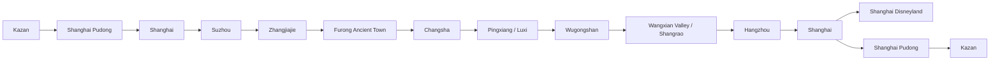

# Transport

This file collects flights, trains, taxis, transfers, hard route segments, and backup route concerns. Problem sections include Furong -> Wugongshan, Wugongshan -> Wangxian, Zhangjiajie/Tianmen/Glass Bridge, Shanghai final days, and Hangzhou.

## Transport Source Data

# 13. Логистика и транспорт

| Дата | Откуда | Куда | Тип | Статус | Риски / что проверить |
|---|---|---|---|---|---|
| 19–20.06 | Kazan KZN | Shanghai PVG T1 | Flight MU-5066 | Подтверждено | Онлайн-табло, документы |
| 20.06 | PVG | Shanghai hotel | Metro/taxi | Календарь | Отель не подтверждён |
| 21.06 | Shanghai | Suzhou | Train/metro? | Календарь | Купить/подтвердить билеты |
| 21–22.06 | Shanghai/Suzhou area | Zhangjiajie | Flight | Календарь, билет не найден в Gmail | Аэропорт/багаж/время |
| 24.06 | Zhangjiajie | Glass Bridge | Local transport | Календарь | Билеты/багаж/время работы |
| 24.06 | Glass Bridge/Zhangjiajie | Furong | Bus/taxi/train? | Календарь | Точный транспорт не подтверждён |
| 25.06 | Furong | Changsha | Train | Календарь | Точный билет не найден |
| 25.06 | Changsha | Pingxiang | Train | Календарь | Пересадка 30 мин может быть рискованной |
| 25.06 | Pingxiang/Luxi | Wugongshan | Taxi/local bus | Календарь | Cableway closes 17:00 |
| 26.06 | Wugongshan | Wangxian / Shangrao | Train/taxi | Календарь | Неизвестная точная схема |
| 27.06 | Shangrao/Wangxian | Hangzhou | Train | Календарь | Купить/подтвердить билет |
| 28.06 | Hangzhou | Shanghai | Train | Не отражено явно | Критический разрыв перед Disney |
| 29.06 | Shanghai hotel | Disneyland | Metro/taxi | Нужна детализация | Ранний вход требует раннего старта |
| 01.07 | Shanghai | PVG T1 | Metro/taxi | Нужна детализация | Запас времени на международный вылет |
| 01.07 | Shanghai PVG | Kazan KZN | Flight MU-5065 | Подтверждено | Не перепутать местное время |

---

## Route Sequence Context

# 3. Даты и общий маршрут

## Текущий каркас

| Дата | День | Регион | Главный смысл дня | Ночёвка |
|---|---:|---|---|---|
| 19.06.2026 | День 0 | Kazan → Shanghai | Вылет из Kazan | Самолёт |
| 20.06.2026 | День 1 | Shanghai | Прилёт, адаптация, отель/багаж, город | Shanghai, отель не подтверждён в доступных письмах |
| 21.06.2026 | День 2 | Suzhou → Zhangjiajie | Сады Suzhou, вечерний/ночной перелёт в Zhangjiajie | XIADUO Hotel, Zhangjiajie |
| 22.06.2026 | День 3 | Zhangjiajie | Tianmen Mountain, 72 Towers | Zhangjiajie, отель на 22–23 не подтверждён письмом |
| 23.06.2026 | День 4 | Zhangjiajie | Zhangjiajie National Forest Park | Zhangjiajie, отель на 23–24 не подтверждён письмом |
| 24.06.2026 | День 5 | Zhangjiajie → Furong | Glass Bridge, переезд, вечерний Furong | Twelve Cities / Furong hotel |
| 25.06.2026 | День 6 | Furong → Changsha → Pingxiang → Wugongshan | Ранний выезд, переезд, подъём к горной ночёвке | Pingxiang Wugong Mountain Meadow Star Tent House |
| 26.06.2026 | День 7 | Wugongshan → Wangxian | Рассвет/спуск, восстановление, переезд, Wangxian lighting | Yangxian Village, Wangxian Valley |
| 27.06.2026 | День 8 | Wangxian/Shangrao → Hangzhou | Утро/буфер, переезд, West Lake, чайный мягкий день | Haoiar Hotel, Hangzhou West Lake Lingyin Temple |
| 28.06.2026 | День 9 | Hangzhou → Shanghai? | Longjing / tea villages / West Lake; далее нужен точный переезд в Shanghai | Shanghai, отель не подтверждён |
| 29.06.2026 | День 10 | Shanghai | Shanghai Disneyland по календарю | Shanghai, отель не подтверждён |
| 30.06.2026 | День 11 | Shanghai | Открытый день / резерв / альтернатива Zhujiajiao | Shanghai, отель не подтверждён |
| 01.07.2026 | День 12 | Shanghai → Kazan | Вылет PVG → Kazan | Самолёт / Kazan |

## Главная логика маршрута

---

## Transport-Related Risks And Checks

# 21. Риски

| Риск | Где возникает | Вероятность | Последствия | Как снизить |
|---|---|---:|---|---|
| Нет Shanghai hotel | 20.06 и 28–01 | Высокая | Негде оставить багаж/ночевать | Срочно проверить Trip.com/почту/забронировать |
| Опоздание на cableway | Wugongshan 25.06 | Высокая | Пеший подъём после 17:00 | Сдвинуть переезд раньше, связаться с отелем |
| Слишком тяжёлый маршрут | 21–26.06 | Высокая | Усталость, срыв планов | Убрать лишние вечерние блоки, буферы |
| Дождь/туман | Zhangjiajie/Wugongshan | Средняя | Нет видов, скользко | Проверка погоды, дождевик, запас времени |
| Нет билетов | Tianmen/Disney/parks | Средняя | Срыв ключевых мест | Купить заранее |
| Китайские каникулы | Disney/parks | Средняя | Толпы | 29.06 до июля, ранний вход |
| Багаж в горах | Wugongshan | Высокая | Невозможно идти комфортно | Оставить большой багаж внизу |
| Неверный отель | Furong name changed | Средняя | Такси привезёт не туда | Использовать адрес + Trip.com current name |
| Поздний заезд | XIADUO/Wangxian | Средняя | Отказ/сложности | Написать заранее |
| Разница времени | Flights/calendar | Средняя | Ошибка расписания | Всегда указывать local time |
| Стёртые кроссовки | Весь маршрут | Высокая | Боль/травмы | Купить и разносить новую обувь |
| Языковой барьер | Вокзалы/такси/отели | Средняя | Потеря времени | Amap, Trip.com, адреса на китайском как backup |

---

## Data Conflicts

# 24. Конфликты данных

| Вопрос | Вариант А | Вариант Б | Предполагаемое текущее состояние | Что проверить |
|---|---|---|---|---|
| Дата Disney | Ранее 22 июня / в середине маршрута | 29 июня в календаре | 29 июня | Купить билет |
| Beijing | Был в старом маршруте | Пользователь убрал после Furong | Beijing архив | Не возвращать без прямого запроса |
| Wugongshan arrival | Календарь: прибытие 17:00 | Отель: cableway closes 17:00 | Конфликт критический | Сдвинуть логистику |
| Furong hotel name | 12C Stream & Mountain View | Twelve Cities Baiyujing... | Название изменено | Использовать актуальное и адрес |
| Pingxiang Wugong booking | Старая бронь 1 519,44 ₽ | Новая бронь 6 155,19 ₽ | Старая отменена, новая активна | Проверить Trip.com orders |
| Hangzhou checkout | 28.06 до 14:00 | 28.06 нужен Shanghai до Disney | Нужен переезд/новый отель | Забронировать Shanghai |
| Zhangjiajie hotels | Есть XIADUO 21–22 | Ночи 22–24 не найдены | Разрыв | Проверить Trip.com |
| XIADUO check-in | До 00:00 | Календарь прибытие 04:30 | Риск late check-in | Написать отелю |

---

## Technical Planning Debt

# 25. Технический долг планирования

- Нет подтверждённого Shanghai hotel 20–21 июня.
- Нет подтверждённого Shanghai hotel 28 июня–1 июля.
- Нет подтверждённых Zhangjiajie hotels 22–24 июня в доступных письмах.
- Нет найденного подтверждения внутреннего flight to Zhangjiajie.
- Нет точных train tickets Furong → Changsha → Pingxiang.
- Нет точного train ticket Shangrao/Wangxian → Hangzhou.
- Нет Hangzhou → Shanghai переезда 28 июня.
- Нет Disneyland ticket на 29 июня.
- Нет подтверждения Tianmen Mountain tickets.
- Нет подтверждения Zhangjiajie National Forest Park tickets.
- Нет Glass Bridge ticket.
- Не решён багаж на Wugongshan.
- Не подтверждено, как попасть в Wugongshan hotel после 17:00.
- Не проверен прогноз погоды на Zhangjiajie/Wugongshan/Wangxian.
- Не оформлен backup plan на дождь/туман.
- Не исправлен Disney timing: 13:00 плохо сочетается с Early Entry.

---
