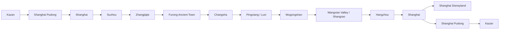

# Sanitized Original Input Archive

This is an archival copy of the original master Markdown input with sensitive data masked. It is not the preferred editing surface; use the repository root Markdown files for ongoing work.

# PROJECT MASTER KNOWLEDGE BASE — CHINA TRIP

> Единый рабочий Markdown-документ по проекту поездки в Китай.  
> Версия собрана 2026-06-14 на основе доступного контекста проекта, календаря, писем Gmail/Trip.com/Kupibilet и присланного мастер-промпта.  
> Часовой пояс маршрута внутри Китая: **China Standard Time, UTC+8**.  
> Важное правило для будущих сессий: названия мест писать **English / transliteration**, а китайские иероглифы добавлять только как вспомогательные для такси, карт и отелей.

---

## 0. Важные ограничения этой версии

Эта база знаний не является буквальной выгрузкой всех старых чатов и файлов проекта, потому что в текущем сеансе не все старые вложения физически доступны как файлы. Использованные источники:

| Источник | Статус доступа | Что извлечено |
|---|---|---|
| Текущий мастер-промпт | Доступен как загруженный текст | Требования к структуре, полноте, формату `.md` |
| Память проекта / доступный контекст проекта “Китай” | Доступен | История маршрутов, предпочтения, отклонённые идеи, требования к стилю планирования |
| Google Calendar | Доступен | Текущие календарные блоки маршрута 20.06–01.07.2026 |
| Gmail / Kupibilet | Доступен | Международные авиабилеты Kazan ⇄ Shanghai, стоимость, багаж |
| Gmail / Trip.com | Доступен | Подтверждённые отели Furong, Wugongshan, Wangxian, Hangzhou, Zhangjiajie; отменённая бронь Wugongshan |
| Старый Excel `Мои заказы.xlsx` из другого чата | Не доступен как активный файл в этом сеансе | Данные восстановлены частично через письма и календарь |
| Старые изображения/скриншоты из других чатов | Не доступны как активные файлы | Содержимое не может быть дословно извлечено, но обсуждения сохранены из контекста |

Персональные номера документов, PIN-коды бронирований и приватные служебные ссылки намеренно **не внесены** в документ. Они есть в исходных письмах и не нужны для будущей ИИ-сессии.

---

# 1. Общая информация

| Поле | Значение |
|---|---|
| Страна | China / Китай |
| Основной период | 19 июня 2026 — 1 июля 2026 |
| Фактическая длительность | 13 календарных дней с перелётом туда и обратно |
| Основные города/регионы | Shanghai, Suzhou, Zhangjiajie, Furong, Wugongshan, Wangxian Valley, Hangzhou |
| Старые / архивные города | Beijing, Chongqing, Longji Rice Terraces, Tonglu / OMG Heartbeat Park |
| Вход/выход | Kazan → Shanghai Pudong → Kazan |
| Стиль поездки | Насыщенная самостоятельная поездка: города, парки, горы, древние городки, Disney, чайные зоны |
| Физическая нагрузка | Средняя–высокая; пик нагрузки — Wugongshan, Zhangjiajie, Disneyland |
| Ключевое предпочтение пользователя | Нужны не идеи, а рабочая логистика: даты, тайминги, транспорт, ночёвки, риски |
| Важное требование к названиям | Не писать только китайскими иероглифами; основной формат — English / transliteration |

---

# 2. Цели поездки

## Основные цели

1. Увидеть современный Shanghai и использовать его как точку входа/выхода.
2. Посетить Shanghai Disneyland в конце маршрута.
3. Посмотреть природные и горные места: Zhangjiajie National Forest Park, Tianmen Mountain, Glass Bridge, Wugongshan.
4. Встроить атмосферные локации: Furong Ancient Town, Wangxian Valley.
5. Сделать Hangzhou спокойным восстановительным городом после гор: West Lake, Lingyin Temple area, Longjing tea, короткие прогулки.
6. Не ломать маршрут ради архивных идей вроде Beijing, Chongqing или Longji, если они выбивают логистику.

## Чего пользователь не хочет

- Общие советы вместо точного маршрута.
- Повторные предложения уже отклонённых вариантов без пометки “архив”.
- Неучёт уже принятых решений.
- Перегруз типа “30 км — это спорт, а не отдых”, если день планируется как путешествие, а не спортивный поход.
- Маршруты с бессмысленными кругами, возвратами и лишними километрами.
- Только китайские названия без английского/transliteration.
- Красивые, но нежизнеспособные планы без проверки транспорта, багажа, билетов и времени.

---

# 3. Даты и общий маршрут

## Текущий каркас

| Дата | День | Регион | Главный смысл дня | Ночёвка |
|---|---:|---|---|---|
| 19.06.2026 | День 0 | Kazan → Shanghai | Вылет из Kazan | Самолёт |
| 20.06.2026 | День 1 | Shanghai | Прилёт, адаптация, отель/багаж, город | Shanghai, отель не подтверждён в доступных письмах |
| 21.06.2026 | День 2 | Suzhou → Zhangjiajie | Сады Suzhou, вечерний/ночной перелёт в Zhangjiajie | XIADUO Hotel, Zhangjiajie |
| 22.06.2026 | День 3 | Zhangjiajie | Tianmen Mountain, 72 Towers | Zhangjiajie, отель на 22–23 не подтверждён письмом |
| 23.06.2026 | День 4 | Zhangjiajie | Zhangjiajie National Forest Park | Zhangjiajie, отель на 23–24 не подтверждён письмом |
| 24.06.2026 | День 5 | Zhangjiajie → Furong | Glass Bridge, переезд, вечерний Furong | Twelve Cities / Furong hotel |
| 25.06.2026 | День 6 | Furong → Changsha → Pingxiang → Wugongshan | Ранний выезд, переезд, подъём к горной ночёвке | Pingxiang Wugong Mountain Meadow Star Tent House |
| 26.06.2026 | День 7 | Wugongshan → Wangxian | Рассвет/спуск, восстановление, переезд, Wangxian lighting | Yangxian Village, Wangxian Valley |
| 27.06.2026 | День 8 | Wangxian/Shangrao → Hangzhou | Утро/буфер, переезд, West Lake, чайный мягкий день | Haoiar Hotel, Hangzhou West Lake Lingyin Temple |
| 28.06.2026 | День 9 | Hangzhou → Shanghai? | Longjing / tea villages / West Lake; далее нужен точный переезд в Shanghai | Shanghai, отель не подтверждён |
| 29.06.2026 | День 10 | Shanghai | Shanghai Disneyland по календарю | Shanghai, отель не подтверждён |
| 30.06.2026 | День 11 | Shanghai | Открытый день / резерв / альтернатива Zhujiajiao | Shanghai, отель не подтверждён |
| 01.07.2026 | День 12 | Shanghai → Kazan | Вылет PVG → Kazan | Самолёт / Kazan |

## Главная логика маршрута

---

# 4. Полный маршрут по дням

## День 0 — 19 июня 2026, пятница

### Локация
Kazan → Shanghai.

### Утро / день
Подготовка к вылету, документы, багаж, деньги, eSIM/связь, Trip.com/Alipay/WeChat/Amap.

### Вечер
Вылет из Kazan Airport в 20:00 местного времени рейсом **MU-5066 China Eastern Airlines**.

### Ночёвка
В самолёте.

### Логистика
- Kazan KZN → Shanghai Pudong PVG Terminal 1.
- Длительность перелёта: 8 ч 10 мин.
- Прибытие: 20 июня 2026, 09:10 местного времени Shanghai.

### Билеты / брони
- Международный билет подтверждён через Kupibilet.
- Заказ Kupibilet: [masked order id].
- Оплата: 02.04.2026.
- Общая сумма за 2 пассажиров с сервисным сбором и страховкой: **112 045,04 ₽**.
- Багаж: **1 место 23 кг на пассажира**.
- Ручная кладь: **1 место 8 кг на пассажира**.

### Риски
- Посадка на сегменты должна быть в порядке следования; пропуск сегмента может аннулировать последующие участки.
- Нужно скачать маршрутную квитанцию на телефон.
- Проверить онлайн-табло перед вылетом.

### Открытые вопросы
- Проверить требования въезда и интернет/связь.
- Проверить, нужны ли распечатки отелей и билетов.

---

## День 1 — 20 июня 2026, суббота

### Локация
Shanghai.

### Утро
- 09:10 прилёт в Shanghai Pudong Terminal 1.
- Календарный блок “разница времени с KZN” 09:00–14:00 выглядит как техническая заглушка/адаптационный буфер.

### День
- 14:00–15:00 метро/такси до отеля.
- 15:00–16:00 регистрация в отеле / оставить багаж.
- 16:00–17:00 обед рядом с отелем.

### Вечер
- 17:00–01:00 календарное “окно”.
- 01:00–02:00 ужин.
- 02:00–11:00 сон.

### Ночёвка
Shanghai. Конкретный отель первого дня в доступных Gmail-подтверждениях не найден.

### Логистика
Переезд из PVG лучше делать с учётом багажа: такси проще, метро дешевле, но тяжелее с чемоданом.

### Что посмотреть
Архивно/потенциально: The Bund, Nanjing Road, Oriental Pearl Tower, Yu Garden. На первый день после перелёта не перегружать.

### Риски
- Jet lag / усталость после ночного перелёта.
- Нет подтверждённого отеля в доступных письмах.
- Если отель далеко от центра или вокзала, день 2 станет тяжелее.

### Открытые вопросы
- Найти/подтвердить отель Shanghai на 20–21 июня.
- Проверить, где оставить багаж, если заселение позднее.

---

## День 2 — 21 июня 2026, воскресенье

### Локация
Shanghai → Suzhou → Zhangjiajie.

### Утро
- 11:00–12:00 сборы.
- 12:00–13:00 путь до Suzhou.

### День
- 13:00–16:00 Suzhou garden 1.
- 16:00–17:00 обед.
- 17:00–23:00 Suzhou gardens 2–3.

### Вечер / ночь
- 23:00–00:00 путь до аэропорта.
- 00:00–01:00 буфер перед вылетом.
- 01:00–03:30 вылет в Zhangjiajie по календарю.
- 03:30–04:30 путь до отеля.
- 04:30–05:00 регистрация.
- 05:00–11:00 сон.

### Ночёвка
**XIADUO Hotel**, Zhangjiajie, подтверждено Trip.com.

### Логистика
Текущий календарь использует Suzhou как дневную вылазку перед ночным перелётом. Это насыщенный день с риском усталости и опоздания к рейсу.

### Билеты / брони
- XIADUO Hotel: заезд 21.06.2026 14:00–00:00, выезд 22.06.2026 до 14:00.
- Адрес: 15th Floor, Building 3, Fuhua Jinxiu Residence, Tianmen Road, Guanliping Subdistrict, Yongding District, Zhangjiajie, Hunan, China.
- Контакт: [masked phone].
- В отель включены/упомянуты купоны на scenic tickets для 2 взрослых; отель предупреждает, что Tianmen Mountain tickets в пиковый сезон могут быть в дефиците.

### Риски
- Ночной перелёт и короткий сон перед Tianmen Mountain.
- Нужно точно подтвердить рейс Shanghai/Suzhou area → Zhangjiajie: аэропорт, время, багаж.
- Заезд XIADUO заявлен до 00:00, а календарь показывает прибытие в отель около 04:30 — нужно связаться с отелем и подтвердить поздний заезд.

### Открытые вопросы
- Где именно аэропорт вылета: PVG или SHA?
- Куплен ли внутренний авиабилет в Zhangjiajie?
- Подтверждён ли поздний/ночной заезд в XIADUO Hotel?

---

## День 3 — 22 июня 2026, понедельник

### Локация
Zhangjiajie / Tianmen Mountain.

### Утро
- 11:00–12:00 сборы.

### День
- 12:00–16:00 Tianmen Mountain.
- 16:00–17:00 обед.
- 17:00–21:00 продолжение Tianmen Mountain.

### Вечер
- 21:00–22:00 ужин.
- 22:00–00:00 chill.
- 00:00–02:00 “72 башни”.
- 02:00–03:00 путь до отеля.
- 03:00–04:00 регистрация.
- 04:00–13:00 сон.

### Ночёвка
Zhangjiajie. Подтверждение конкретного отеля на ночь 22–23 июня в доступных письмах не найдено.

### Логистика
Tianmen Mountain лучше бронировать/проверять заранее: отель XIADUO прямо предупреждает, что билеты в высокий сезон могут быть в дефиците.

### Риски
- После ночного перелёта день тяжёлый.
- Tianmen Mountain зависит от погоды и слотов билетов/канатки.
- 72 Towers ночью добавляет нагрузку.

### Открытые вопросы
- Где ночёвка 22–23 июня?
- Куплены ли Tianmen Mountain tickets?
- Реалистичен ли блок 72 Towers после Tianmen, учитывая сон и переезды?

---

## День 4 — 23 июня 2026, вторник

### Локация
Zhangjiajie National Forest Park.

### Утро
- 13:00–14:00 завтрак.
- 14:00–15:00 путь до входа в парк.

### День
- 15:00–22:00 Zhangjiajie National Forest Park.

### Вечер
- 22:00–23:00 ужин.
- 23:00–03:00 chill.
- 03:00–12:00 сон.

### Ночёвка
Zhangjiajie. Конкретный отель на ночь 23–24 июня не подтверждён в доступных письмах.

### Что посмотреть
Zhangjiajie National Forest Park / Avatar mountains. Точный маршрут по парку в доступном контексте не детализирован.

### Риски
- Поздний старт в 15:00 может быть слишком коротким для полноценного парка.
- Большие расстояния внутри парка, очереди, канатки, автобусы.
- Дождь/туман может закрыть виды.

### Открытые вопросы
- Уточнить вход в парк, билеты, маршрут внутри парка, время закрытия.
- Подтвердить отель на 23–24 июня.

---

## День 5 — 24 июня 2026, среда

### Локация
Zhangjiajie → Glass Bridge → Furong Ancient Town.

### Утро
- 12:00–13:00 завтрак.
- 13:00–14:00 путь до Glass Bridge.

### День
- 14:00–16:00 Glass Bridge.
- 16:00–17:00 обед.
- 17:00–18:00 окно.
- 18:00–19:00 путь до Furong.

### Вечер
- 19:00–02:00 Furong.
- 02:00–02:15 путь до отеля.
- 02:15–02:30 регистрация.

### Ночёвка
**Twelve Cities · BaiyujingCourtyardHotSpringResortDesignHotel (FurongTown ScenicAreaBranch)**, бывшее название **12C · Stream & Mountain View Courtyard Hot Spring Pool Resort (Furong Ancient Town Branch)**.

### Билеты / брони
- Заезд: 24.06.2026 после 14:00.
- Выезд: 25.06.2026 до 12:00.
- Адрес: 100 meters north of Xiangxi World Geological Museum, Pedestrian Street, Furong Town, Yongshun, Hunan, China.
- Контакты: [masked phone], [masked phone].
- Оплачено онлайн: **3 327,87 ₽**.
- Условия: изменение невозможно, возврат при отмене невозможен / no-show charged.
- В брони упоминался пакет: Mainland China eSIM 5 days 3GB.

### Риски
- Поздний приезд/регистрация в Furong.
- Нужно не пропустить изменение названия отеля.
- На следующий день ранний выезд в сторону Wugongshan; нельзя зависнуть в Furong слишком поздно.

### Открытые вопросы
- Точный транспорт Zhangjiajie/Glass Bridge → Furong.
- Где оставить багаж во время Glass Bridge.
- Реалистичность 19:00–02:00 Furong перед тяжёлым переездом 25 июня.

---

## День 6 — 25 июня 2026, четверг

### Локация
Furong → Changsha → Pingxiang / Luxi → Wugongshan.

### Утро
- 02:30–11:00 ночёвка в Furong.
- 11:00–12:45 сборы и поездка до вокзала.

### День
- 12:45–15:45 поезд до Changsha.
- 15:45–16:15 пересадка.
- 16:15–17:00 поезд Changsha → Pingxiang.
- 17:00–19:00 переезд к Wugongshan + старт маршрута.

### Вечер
- 19:00–02:00 Wugongshan hiking до палаточной зоны.

### Ночёвка
**Pingxiang Wugong Mountain Meadow Star Tent House** / Guanyindang Tent Festival Camping Base, Wugongshan Scenic Area.

### Билеты / брони
- Заезд: 25.06.2026 после 12:00.
- Выезд: 26.06.2026 06:00–12:00.
- Адрес: Guanyindang (Tent Festival Camping Base), Wugongshan Scenic Area, Luxi, Jiangxi, China.
- Контакты: [masked phone], [masked phone].
- Оплачено онлайн: **6 155,19 ₽**.
- Важное ограничение отеля: отель находится в scenic area, для входа нужны scenic area tickets.
- Критическое ограничение транспорта: cableway заканчивается в 17:00; после 17:00 нужно подниматься на гору самостоятельно.

### Риски
- Это самый проблемный день маршрута: долгий переезд + старт Wugongshan + ночёвка на горе.
- Календарный приезд к зоне Wugongshan 17:00 конфликтует с окончанием cableway в 17:00.
- Если опоздать на cableway, придётся идти пешком в темноту.
- Багаж: нельзя тащить большой чемодан на гору.
- Дождь/грязь/туман резко увеличивают сложность.

### Открытые вопросы
- Купить/проверить точные поезда Furong/Changsha/Pingxiang.
- Проверить, какой вокзал нужен для Wugongshan.
- Проверить, где оставить большой багаж перед подъёмом.
- Написать в Pingxiang Wugong Mountain Meadow Star Tent House и уточнить позднее прибытие, cableway, входные билеты, трансфер.

---

## День 7 — 26 июня 2026, пятница

### Локация
Wugongshan → Wangxian Valley.

### Утро
- 02:00–11:00 горная ночёвка.
- По смыслу дня: рассвет, Golden Summit/виды, спуск.

### День
- 11:00–19:00 Wugongshan — рассвет, спуск, еда, душ/отдых.

### Вечер
- 19:00–22:00 переезд Wugongshan → Wangxian.
- 22:00–02:00 Wangxian Valley evening lighting.

### Ночёвка
**Yangxian Village, Wangxian Valley**, Shangrao.

### Билеты / брони
- Заезд: 26.06.2026 после 17:00.
- Выезд: 27.06.2026 до 12:00.
- Адрес: Inside the Visitor Service Center, County Road 636, Wangxian Gorge Town, Guangxin District, Shangrao, Jiangxi, China.
- Контакт: [masked phone].
- Оплачено онлайн: **9 333,65 ₽**.
- Условия: non-changeable, non-refundable.
- Пакет: scenic area tickets для Wangxian Valley для 2 взрослых; получение на ресепшене; предварительное бронирование не требуется; доступное время 09:30–21:00.

### Риски
- После Wugongshan может быть сильная усталость; транспорт до Wangxian нельзя делать слишком плотным.
- При задержке на спуске можно приехать в Wangxian слишком поздно и потерять подсветку.
- Wangxian tourist-heavy, главная ценность — вечер/ночная атмосфера.

### Открытые вопросы
- Точный транспорт Wugongshan → Shangrao/Wangxian.
- Проверить, как работают included tickets, если прибытие после 21:00.
- Проверить, можно ли заселиться поздно.

---

## День 8 — 27 июня 2026, суббота

### Локация
Wangxian / Shangrao → Hangzhou.

### Утро
- 02:00–11:00 ночёвка.
- 11:00–12:00 завтрак.
- 12:00–14:30 окно.
- 14:30–15:30 сборы.

### День
- 15:30–17:45 переезд Wangxian / Shangrao → Hangzhou.

### Вечер
- 17:45–02:00 Hangzhou — заселение, West Lake, еда, спокойный день без перегруза.

### Ночёвка
**Haoiar Hotel (Hangzhou West Lake Lingyin Temple)**.

### Билеты / брони
- Заезд: 27.06.2026 после 14:00.
- Выезд: 28.06.2026 до 14:00.
- Адрес: No. 2 Xiamaojiabu, Longjing Road, Xihu District, Hangzhou, Zhejiang, China.
- Контакт: [masked phone].
- Оплата в отеле: **442 CNY**.
- Онлайн-гарантия: **4 814,45 ₽**, должна быть возвращена после выезда.
- Бесплатная отмена до 14:00 27.06.2026.

### Риски
- После Wugongshan и Wangxian день должен быть восстановительным.
- Нужно не планировать тяжелые “горки” в Hangzhou сразу вечером.

### Открытые вопросы
- Точный поезд Shangrao → Hangzhou.
- Проверить, возвращается ли гарантия автоматически после checkout.

---

## День 9 — 28 июня 2026, воскресенье

### Локация
Hangzhou / возможно переезд в Shanghai.

### Утро / день
- 09:00–18:00 Hangzhou Longjing / tea villages / West Lake.
- Основные точки: Longjing Village, Meijiawu, West Lake, Lingyin Temple area, Nine Creeks / Jiuxi при наличии сил.

### Вечер
Нужен точный переезд в Shanghai или ночёвка в Shanghai. В календаре на 28 июня после 18:00 явного переезда нет.

### Ночёвка
Shanghai — **не подтверждено доступными письмами**. Hangzhou hotel заканчивается 28 июня до 14:00, поэтому после этого нужна новая ночёвка/багажный план.

### Риски
- Разрыв в бронированиях после checkout в Hangzhou.
- Если Disneyland 29 июня, лучше ночевать в Shanghai 28/29.
- Нужно не оставлять переезд Hangzhou → Shanghai на утро Disney-дня.

### Открытые вопросы
- Купить/подтвердить поезд Hangzhou → Shanghai.
- Забронировать/найти отель Shanghai на 28–30 июня или 28–01 июля.
- Где оставить багаж 28 июня после checkout в Hangzhou.

---

## День 10 — 29 июня 2026, понедельник

### Локация
Shanghai Disneyland.

### Утро
Подъём, переезд к Disneyland. По календарю Disney стоит 13:00–03:45, что означает поздний старт. Для полноценного Disney лучше быть у входа сильно раньше, особенно при покупке Early Park Entry Pass.

### День / вечер
Shanghai Disneyland.

### Ночёвка
Shanghai, отель не подтверждён в доступных письмах.

### Билеты / брони
В обсуждениях фигурировал **One-Day Dated Ticket with Early Park Entry Pass**:
- One-Day Dated Ticket.
- Early Park Entry Pass.
- Билет датированный: дата выбирается при покупке, вход только в выбранный день.
- Категории: Standard, Child 3–11, Senior 60+, Guest with disabilities.
- Упоминалось изменение Early Park Entry Pass benefit: Buzz Lightyear Planet Rescue replaces Jet Packs among included attractions on June 10, 2026.

### Риски
- Билеты на нужную дату могли быть ещё недоступны в момент прошлого обсуждения.
- Нужно проверить availability на 29 июня.
- Летние каникулы в Китае обычно начинаются около 1 июля, поэтому 29 июня потенциально лучше, чем июль, но всё равно возможны толпы.
- Поздний старт 13:00 конфликтует с идеей Early Entry.

### Открытые вопросы
- Купить билет на 29 июня.
- Решить, нужен ли Early Park Entry Pass.
- Проверить hotel-to-Disney logistics и обратный транспорт вечером.

---

## День 11 — 30 июня 2026, вторник

### Локация
Shanghai.

### Смысл дня
Буфер / последний полноценный день в Shanghai / альтернатива после Disneyland.

### Архивная идея
**Zhujiajiao Ancient Town** обсуждался на 30 июня, но пользователь отверг его как “не красивый”. Значит, по умолчанию не ставить как основной план.

### Возможные альтернативы
- Shanghai city: The Bund, Lujiazui, Nanjing Road, Yu Garden, French Concession.
- Более лёгкий день с чемоданом: торговые центры, набережная, кафе, смотровая.
- Dragon Boat / драконьи лодки в Shanghai — если дата/события совпадают и подтверждены.

### Ночёвка
Shanghai, отель не подтверждён.

### Риски
- Нет подтверждённой ночёвки в Shanghai.
- Если обратный вылет 1 июля в 12:40, лучше жить удобно к PVG или с прямой логистикой.

### Открытые вопросы
- Забронировать последнюю ночь в Shanghai.
- Решить, чем заменить Zhujiajiao.
- Проверить актуальные события Dragon Boat / лодки, если это всё ещё интересно.

---

## День 12 — 1 июля 2026, среда

### Локация
Shanghai → Kazan.

### Утро
Переезд в Shanghai Pudong Terminal 1. На международный рейс закладывать запас.

### День
- 12:40 вылет PVG → Kazan рейсом **MU-5065 China Eastern Airlines**.
- 17:00 прибытие в Kazan по местному времени.
- В календаре отображено 12:40–22:00 в China time, но маршрутная квитанция показывает прибытие KZN 17:00 местного времени.

### Билеты / брони
- Билет подтверждён в том же заказе Kupibilet.
- Багаж: 1 × 23 кг на пассажира.
- Ручная кладь: 1 × 8 кг на пассажира.

### Риски
- Не перепутать местное время China/Kazan.
- Нужно приехать в PVG заранее.
- Проверить terminal 1 и онлайн-табло.

---

# 5. Карта городов и локаций

| Локация | Роль в маршруте | Статус | Комментарий |
|---|---|---|---|
| Shanghai | Вход/выход, Disney, город | Принято | Не хватает подтверждённых отелей в начале/конце |
| Suzhou | Сады перед перелётом в Zhangjiajie | Принято в календаре, но требует проверки | Насыщенный день с риском опоздания |
| Zhangjiajie | Avatar mountains, Tianmen, Glass Bridge | Принято | Есть отель только на 21–22 в доступных письмах |
| Furong Ancient Town | Вечерняя атмосферная остановка | Принято | Отель подтверждён, ранний выезд дальше |
| Wugongshan / Wugong Mountain | Главная горная кульминация | Принято, но рискованно | Нужно критически проверить cableway и прибытие |
| Wangxian Valley | Вечерняя подсветка после Wugongshan | Принято | Отель и билеты в пакете подтверждены |
| Hangzhou | Восстановление, чай, West Lake, Lingyin | Принято | Отель подтверждён на 27–28 |
| Zhujiajiao Ancient Town | Идея на 30 июня | Отклонено пользователем | “Не красивый” |
| Beijing | Старый якорь маршрута | Отклонено/архив | После Furong маршрут должен идти к Wugongshan и Shanghai |
| Chongqing | Рассматривался как добавление | Архив / под вопросом | В текущий маршрут не встроен |
| Longji Rice Terraces | Архивная красивая идея | Архив | Не стоит ломать маршрут ради Longji |
| OMG Heartbeat Park / Tonglu | Аттракционы около Hangzhou | Архив / опционально | Возможно только если освобождается день |

---

# 6. Shanghai

## Зачем нужен

- Точка входа и выхода.
- База для Disneyland.
- Современный городской контраст после гор и древних поселений.

## Что делать

- The Bund.
- Lujiazui / Oriental Pearl Tower.
- Nanjing Road.
- Yu Garden.
- French Concession.
- Shanghai Disneyland.
- Возможные Dragon Boat Festival / dragon boats events, если дата и место подтверждены.

## Где жить

### Первый день
Нужен отель на 20–21 июня. В доступных письмах подтверждение не найдено.

Лучшие зоны по прошлой логике:
- People’s Square.
- Nanjing Road.
- Jing’an.
- Удобно к метро/вокзалам/аэропорту.

### Последние дни
Нужен отель минимум на 28/29/30 июня, желательно:
- либо ближе к Disneyland, если 29 июня Disney;
- либо в центре с удобным выездом в PVG 1 июля;
- не выбирать место, из которого тяжело возвращаться ночью после Disney.

## Риски

- Отели Shanghai не подтверждены в доступных письмах.
- Чемодан в последние дни: нужно заранее понять, где хранить багаж.
- Disneyland-день лучше не начинать из Hangzhou.

---

# 7. Shanghai Disneyland

## Текущее решение

- Плановая дата по календарю: **29 июня 2026**.
- Календарный блок: 13:00–03:45.
- В обсуждении фигурировал Early Park Entry Pass.

## История решения

1. Первоначально Disney рассматривался раньше в маршруте, даже как 6 часов в день вылета.
2. Далее проверялась идея совместить Disney и вечерний перелёт в Zhangjiajie 22 июня.
3. Затем решение сместилось: Disney лучше поставить в конце маршрута, после Hangzhou и перед вылетом домой.
4. Дата 29 июня стала рабочей.
5. 30 июня оставлен как буфер/Shanghai day.

## Билет

Обсуждавшийся продукт:

**One-Day Dated Ticket with Early Park Entry Pass**

Состав:
- One-Day Dated Ticket.
- Early Park Entry Pass.

Особенности:
- Билет датированный.
- При покупке выбирается дата посещения.
- Вход только в выбранный день.
- Категории: Standard, Child, Senior, Guest with disabilities.
- Для guests with disabilities нужны документы/подтверждения.
- После 10 июня 2026 в Early Park Entry Pass обсуждалась замена Jet Packs на Buzz Lightyear Planet Rescue.

## Почему 29 июня может быть хорошей датой

- В проекте учитывалось, что китайские летние каникулы обычно стартуют примерно с 1 июля.
- 29 июня может быть лучше июля по толпам, но это не гарантия.

## Риски

| Риск | Комментарий | Что сделать |
|---|---|---|
| Нет билета | На момент обсуждения нужные даты могли быть недоступны | Проверить официальный канал и купить |
| Поздний старт | Календарь стоит с 13:00, Early Entry требует раннего входа | Исправить тайминг |
| Толпы | Конец июня всё равно может быть загружен | Прийти рано, взять early entry при разумной цене |
| Усталость | После гор, Wangxian и Hangzhou | Оставить 30 июня лёгким |

---

# 8. Hangzhou

## Роль

Hangzhou — не “галопом всё”, а восстановительный город после Wugongshan/Wangxian.

## Главная связка

- Lingyin Temple / Feilai Feng.
- West Lake.
- Longjing Village.
- Meijiawu tea village.
- Nine Creeks / Jiuxi.
- Hills / короткие природные прогулки.

## Где жить

Выбранный и подтверждённый отель: **Haoiar Hotel (Hangzhou West Lake Lingyin Temple)**.

Логически подходящие районы:
- Lingyin–West Lake Scenic Area.
- Manjuelong.
- Yangmeiling.
- Santai Yunshe.
- Longjing Road / Xiamaojiabu.

## Бронь

| Поле | Значение |
|---|---|
| Отель | Haoiar Hotel (Hangzhou West Lake Lingyin Temple) |
| Заезд | 27.06.2026 после 14:00 |
| Выезд | 28.06.2026 до 14:00 |
| Адрес | No. 2 Xiamaojiabu, Longjing Road, Xihu District, Hangzhou |
| Оплата | 442 CNY при заселении |
| Гарантия | 4 814,45 ₽, должна вернуться после выезда |

## Риски

- Только одна ночь, а хочется озеро + храм + чай + горки.
- Не перегружать 27 июня после переезда.
- 28 июня нужно решить переезд в Shanghai.

---

# 9. Furong

## Роль

Furong Ancient Town — вечерняя атмосферная точка между Zhangjiajie и Wugongshan.

## Текущий план

- Приезд 24 июня вечером.
- Вечерний Furong 19:00–02:00 по календарю.
- Ночёвка 24–25 июня.
- Ранний/средний выезд 25 июня в сторону Changsha → Pingxiang → Wugongshan.

## Бронь

| Поле | Значение |
|---|---|
| Текущее название | Twelve Cities · BaiyujingCourtyardHotSpringResortDesignHotel(FurongTown ScenicAreaBranch) |
| Старое название | 12C · Stream & Mountain View Courtyard Hot Spring Pool Resort (Furong Ancient Town Branch) |
| Заезд | 24.06.2026 после 14:00 |
| Выезд | 25.06.2026 до 12:00 |
| Адрес | 100 meters north of Xiangxi World Geological Museum, Pedestrian Street, Furong Town, Yongshun, Hunan |
| Контакты | [masked phone], [masked phone] |
| Оплачено | 3 327,87 ₽ |
| Условия | Невозвратная / non-changeable |

## Риски

- Поздний осмотр Furong перед тяжёлым днём Wugongshan.
- Нужно заранее понять, как добраться от Furong к вокзалу.
- Название отеля менялось, не перепутать в Trip.com / taxi.

---

# 10. Wugongshan / Wugong Mountain

## Роль

Wugongshan — главная горная часть маршрута и самая рискованная логистическая связка.

## Ключевые точки

- Wugongshan Scenic Area.
- Zhong’an Cableway — обсуждался как вариант подъёма/спуска.
- Guanyintang / Guanyindang Camp.
- Pingxiang Wugong Mountain Meadow Star Tent House.
- Golden Summit.

## Текущий наиболее адекватный вариант

Смысл: не делать спортивный 30-километровый круг, а использовать транспорт/канатки там, где это снижает бессмысленную нагрузку, и добраться к ночёвке без гонки.

Рабочий принцип:
1. 25 июня максимально рано уйти из Furong.
2. Добраться через Changsha/Pingxiang/Luxi к Wugongshan.
3. Оставить лишний багаж до подъёма.
4. Подняться к Guanyindang / палаточной зоне.
5. Ночевать в Pingxiang Wugong Mountain Meadow Star Tent House.
6. 26 июня рассвет / Golden Summit / виды.
7. Спуск без спешки.
8. Переезд в Wangxian только после восстановления.

## Критический конфликт cableway

Trip.com-подтверждение отеля говорит: **канатная дорога заканчивается в 17:00**, после 17:00 нужно подниматься на гору самостоятельно. Календарь сейчас ставит прибытие к Wugongshan в 17:00 и старт маршрута 17:00–19:00, что опасно.

### Что нужно сделать

- Подтвердить расписание cableway на дату 25 июня.
- Сдвинуть переезд из Furong раньше, если возможно.
- Узнать у отеля, какой подъём нужен именно к Guanyindang Camp.
- Проверить, возможно ли оставить багаж у подножия.

## История вариантов маршрута Wugongshan

| Версия | Описание | Плюсы | Минусы | Почему изменили |
|---|---|---|---|---|
| Ранние круги | Много пеших участков, возвраты, круги | Максимум видов | Слишком много км, риск “спорт вместо отдыха” | Пользователь отверг бессмысленные круги |
| 30 км | Большой спортивный маршрут | Амбициозно | “30 км — это спорт, а не отдых” | Не соответствует стилю поездки |
| Zhong’an + Guanyintang + Golden Summit | Подъём канаткой, переход к camp / summit, спуск | Снижает нагрузку | Нужно точно проверить, куда поднимает cableway и сколько идти | Требует верификации картой/2bulu/Trip.com |
| Текущий календарный | Furong→Changsha→Pingxiang→Wugongshan, hike to tent | Сохранён в календаре | Прибытие около 17:00 конфликтует с cableway | Нужна корректировка времени |

## Бронь

| Поле | Значение |
|---|---|
| Отель | Pingxiang Wugong Mountain Meadow Star Tent House |
| Local / CN name | Wugongshan Guanyindang Meadow Star Outdoor Camp |
| Заезд | 25.06.2026 после 12:00 |
| Выезд | 26.06.2026 06:00–12:00 |
| Адрес | Guanyindang (Tent Festival Camping Base), Wugongshan Scenic Area, Luxi, Jiangxi |
| Контакты | [masked phone], [masked phone] |
| Оплачено | 6 155,19 ₽ |
| Ограничения | Scenic area ticket required; cableway ends 17:00 |

## Отменённая бронь

- Старое бронирование Pingxiang Wugong Mountain Meadow Star Tent House было отменено бесплатно.
- Сумма возврата: **1 519,44 ₽**.
- Новая активная бронь — на 6 155,19 ₽.

## Риски Wugongshan

| Риск | Последствие | Снижение |
|---|---|---|
| Опоздание на cableway | Пеший подъём в темноте | Приехать раньше 15:30–16:00 или подтвердить альтернативу |
| Дождь / туман | Скользкие тропы, нет видов | Проверить погоду, дождевик, треккинговая обувь |
| Большой багаж | Невозможно идти комфортно | Оставить внизу, взять малый рюкзак |
| Перегруз после Furong | Срыв темпа | Спать раньше, сократить вечер Furong |
| Непонятная тропа | Потеря времени | Скачать offline map, уточнить у отеля, Amap/2bulu |
| Переезд в Wangxian после спуска | Опоздание/усталость | Не ставить плотный транспорт сразу после спуска |

---

# 11. Wangxian

## Роль

Wangxian Valley — вечерняя визуальная точка после Wugongshan, главный смысл — подсветка и атмосфера.

## Что делать кроме подсветки

- Дневная прогулка по valley / village.
- Видовые точки и мосты.
- Еда / кафе / восстановление после Wugongshan.
- Фото вечером и ночью.
- Не делать из Wangxian тяжёлый hiking day.

## Бронь

| Поле | Значение |
|---|---|
| Отель | Yangxian Village, Wangxian Valley |
| Заезд | 26.06.2026 после 17:00 |
| Выезд | 27.06.2026 до 12:00 |
| Адрес | Inside the Visitor Service Center, County Road 636, Wangxian Gorge Town, Guangxin District, Shangrao, Jiangxi |
| Контакт | [masked phone] |
| Оплачено | 9 333,65 ₽ |
| Билеты | 2 adult scenic tickets included, получение на ресепшене |
| Условия | Невозвратная, non-changeable |

## Риски

- Если прийти после 21:00, могут быть вопросы с выдачей included ticket / входом.
- После Wugongshan будет усталость.
- Место туристическое, может быть crowded.

---

# 12. Chongqing и другие альтернативы

## Chongqing

Статус: архив / под вопросом. Пользователь спрашивал, можно ли добавить Chongqing, но в текущий маршрут он не встроен.

Причина: после Furong маршрут уже развёрнут к Wugongshan → Wangxian → Hangzhou → Shanghai. Добавление Chongqing создаёт большой крюк и ломает плотную логистику.

## Beijing

Статус: отклонено / архив.

История:
- Ранние версии включали Beijing как “якорь масштаба”: Great Wall, Forbidden City, museums.
- Затем пользователь зафиксировал: после Furong не идти в Beijing, а повернуть к Wugongshan и далее east toward Shanghai.

## Longji Rice Terraces

Статус: архив.

Идея: Longji Rice Terraces near Guilin, конец июня — зелёные террасы. Минус: 100 км от Guilin, 2–3 часа, ломает маршрут.

## Tonglu / OMG Heartbeat Park / Daqi Mountain

Статус: архив / только при свободном дне.

Причина интереса: пользователь хотел “прикольные аттракционы”, mountain carts/slides. Но текущий Hangzhou уже очень короткий и восстановительный.

## Zhujiajiao Ancient Town

Статус: отклонено.

Причина: пользователь сказал, что место “не красивое”; не ставить как основной план на 30 июня.

---

# 13. Логистика и транспорт

| Дата | Откуда | Куда | Тип | Статус | Риски / что проверить |
|---|---|---|---|---|---|
| 19–20.06 | Kazan KZN | Shanghai PVG T1 | Flight MU-5066 | Подтверждено | Онлайн-табло, документы |
| 20.06 | PVG | Shanghai hotel | Metro/taxi | Календарь | Отель не подтверждён |
| 21.06 | Shanghai | Suzhou | Train/metro? | Календарь | Купить/подтвердить билеты |
| 21–22.06 | Shanghai/Suzhou area | Zhangjiajie | Flight | Календарь, билет не найден в Gmail | Аэропорт/багаж/время |
| 24.06 | Zhangjiajie | Glass Bridge | Local transport | Календарь | Билеты/багаж/время работы |
| 24.06 | Glass Bridge/Zhangjiajie | Furong | Bus/taxi/train? | Календарь | Точный транспорт не подтверждён |
| 25.06 | Furong | Changsha | Train | Календарь | Точный билет не найден |
| 25.06 | Changsha | Pingxiang | Train | Календарь | Пересадка 30 мин может быть рискованной |
| 25.06 | Pingxiang/Luxi | Wugongshan | Taxi/local bus | Календарь | Cableway closes 17:00 |
| 26.06 | Wugongshan | Wangxian / Shangrao | Train/taxi | Календарь | Неизвестная точная схема |
| 27.06 | Shangrao/Wangxian | Hangzhou | Train | Календарь | Купить/подтвердить билет |
| 28.06 | Hangzhou | Shanghai | Train | Не отражено явно | Критический разрыв перед Disney |
| 29.06 | Shanghai hotel | Disneyland | Metro/taxi | Нужна детализация | Ранний вход требует раннего старта |
| 01.07 | Shanghai | PVG T1 | Metro/taxi | Нужна детализация | Запас времени на международный вылет |
| 01.07 | Shanghai PVG | Kazan KZN | Flight MU-5065 | Подтверждено | Не перепутать местное время |

---

# 14. Отели и ночёвки

| Дата | Город | Отель | Статус | Оплата / стоимость | Проверить |
|---|---|---|---|---|---|
| 20–21.06 | Shanghai | Не найден в доступных письмах | Открыто | Нет данных в доступных письмах | Срочно подтвердить/забронировать |
| 21–22.06 | Zhangjiajie | XIADUO Hotel | Подтверждено | Цена не извлечена из-за обрезанного письма | Поздний заезд после 00:00 |
| 22–23.06 | Zhangjiajie | Не найден | Открыто | Нет данных | Нужна бронь/подтверждение |
| 23–24.06 | Zhangjiajie | Не найден | Открыто | Нет данных | Нужна бронь/подтверждение |
| 24–25.06 | Furong | Twelve Cities / former 12C | Подтверждено | 3 327,87 ₽ paid | Не перепутать новое название |
| 25–26.06 | Wugongshan | Pingxiang Wugong Mountain Meadow Star Tent House | Подтверждено | 6 155,19 ₽ paid | Scenic ticket, cableway before 17:00 |
| 26–27.06 | Wangxian | Yangxian Village, Wangxian Valley | Подтверждено | 9 333,65 ₽ paid | Included tickets, поздний заезд |
| 27–28.06 | Hangzhou | Haoiar Hotel | Подтверждено | 442 CNY pay at hotel + 4 814,45 ₽ guarantee | Возврат гарантии |
| 28–29.06 | Shanghai | Не найден | Открыто | Нет данных | Срочно |
| 29–30.06 | Shanghai | Не найден | Открыто | Нет данных | Срочно |
| 30.06–01.07 | Shanghai | Не найден | Открыто | Нет данных | Срочно, удобство к PVG |

---

# 15. Брони, билеты и календарь

| Дата | Тип | Название | Город | Время | Статус | Источник | Что проверить |
|---|---|---|---|---|---|---|---|
| 19.06 | Flight | MU-5066 Kazan → Shanghai PVG | Kazan/Shanghai | 20:00→09:10 | Confirmed | Kupibilet/Gmail | Online board |
| 20.06 | Calendar | Shanghai arrival / hotel / lunch / window | Shanghai | 09:10 onward | Draft | Calendar | Hotel |
| 21.06 | Calendar | Suzhou gardens | Suzhou | 13:00–23:00 | Draft | Calendar | Train/entry tickets |
| 21–22.06 | Flight/calendar | Flight to Zhangjiajie | Shanghai→Zhangjiajie | 01:00–03:30 | Needs confirmation | Calendar | Ticket in Trip.com/Gmail |
| 21–22.06 | Hotel | XIADUO Hotel | Zhangjiajie | Check-in 14:00–00:00 | Confirmed | Trip.com/Gmail | Late arrival |
| 22.06 | Attraction | Tianmen Mountain | Zhangjiajie | 12:00–21:00 | Planned | Calendar | Buy tickets |
| 23.06 | Attraction | Zhangjiajie National Forest Park | Zhangjiajie | 15:00–22:00 | Planned | Calendar | Route + tickets |
| 24.06 | Attraction | Glass Bridge | Zhangjiajie | 14:00–16:00 | Planned | Calendar | Ticket/time |
| 24–25.06 | Hotel | Twelve Cities / Furong hotel | Furong | Check-in after 14:00 | Confirmed | Trip.com/Gmail | Name changed |
| 25–26.06 | Hotel | Wugongshan Meadow Star Tent House | Wugongshan | Check-in after 12:00 | Confirmed | Trip.com/Gmail | Cableway/scenic ticket |
| 26–27.06 | Hotel | Yangxian Village, Wangxian Valley | Wangxian | Check-in after 17:00 | Confirmed | Trip.com/Gmail | Ticket pickup before 21:00 |
| 27–28.06 | Hotel | Haoiar Hotel | Hangzhou | Check-in after 14:00 | Confirmed | Trip.com/Gmail | Guarantee refund |
| 29.06 | Park | Shanghai Disneyland | Shanghai | 13:00–03:45 | Planned, ticket unknown | Calendar/project context | Buy ticket, adjust start |
| 01.07 | Flight | MU-5065 Shanghai PVG → Kazan | Shanghai/Kazan | 12:40→17:00 local | Confirmed | Kupibilet/Gmail | Online board |

---

# 16. Что нужно забронировать

## Срочно

- Shanghai hotel 20–21 June.
- Shanghai hotel 28 June–1 July или минимум 28–30 и 30–1.
- Hangzhou → Shanghai train for 28 June.
- Shanghai Disneyland ticket for 29 June.
- Проверить/купить Tianmen Mountain tickets.
- Проверить/купить Zhangjiajie National Forest Park tickets.
- Проверить/купить Glass Bridge tickets.
- Точные поезда Furong → Changsha → Pingxiang / Luxi.
- Транспорт Pingxiang/Luxi → Wugongshan.

## Можно позже, но до поездки

- Local taxis/transfers where unclear.
- SIM/eSIM if не решено.
- Insurance / offline copies.
- Резервные планы на дождь.

## Можно на месте

- Еда.
- Часть городских перемещений.
- Лёгкие Shanghai activities без строгих билетов.

## Нельзя оставлять на месте

- Горные отели и ночёвки.
- Disney ticket.
- Вход/канатки Wugongshan, если ограничены слотами.
- Zhangjiajie/Tianmen tickets в пиковый период.
- Последние ночи в Shanghai.

---

# 17. Багаж и вещи

## Багаж

Фактический лимит международных перелётов:
- checked baggage: 1 × 23 kg на пассажира;
- cabin baggage: 1 × 8 kg на пассажира.

Для маршрута нужен принцип разделения:
- большой чемодан / основная сумка — города, поезда, отели;
- малый рюкзак — горы, Wugongshan, день в парках;
- отдельный dry bag / zip пакеты — документы, техника, одежда от дождя.

## Взять из дома

- Паспорт и копии.
- Билеты/ваучеры offline.
- Банковские карты + запас наличных/юаней.
- Удобная городская одежда на жару.
- Powerbank.
- Зарядки, переходник, кабели.
- Малый рюкзак 20–30 л.
- Дождевик/лёгкая мембрана.
- Аптечка.

## Купить в Китае

- Часть одежды на жару.
- Простые футболки/носки/мелочи.
- Зонт/дождевик, если не взяли.
- SIM/eSIM/tourist SIM, если не куплено заранее.

## Купить срочно до поездки

- Новые кроссовки/обувь: старые кроссовки стёрты, а маршрут с горами и парками.
- Носки влагоотводящие.
- Малый рюкзак, если нет.
- Лёгкий дождевик.

## Не брать

- Слишком много одежды “на всякий случай”.
- Тяжёлую обувь без разноски.
- Большой жёсткий чемодан на участки, где много лестниц/переездов, без плана хранения.

## Для Wugongshan

- Малый рюкзак.
- Вода.
- Перекус.
- Дождевик.
- Сухой пакет для документов.
- Powerbank.
- Фонарик/налобник, особенно если риск подъёма после 17:00.
- Тёплый лёгкий слой на гору, но без лишнего веса.

---

# 18. Одежда и обувь

## Обувь

Главный риск: пользователь сообщил, что родные кроссовки уже стёрты. Нужно заменить до поездки и хотя бы немного разносить.

Требования:
- удобные для 15–25 тыс. шагов в день;
- нормальная подошва на мокрых камнях/ступенях;
- не новые “из коробки” в день вылета;
- не слишком тяжёлые.

## Термобельё / термуха

Термуха не является базовой вещью для конца июня в Китае. Может пригодиться только как лёгкий слой на Wugongshan ночью/на рассвете, если прогноз прохладный/ветреный. Полный зимний комплект не нужен.

## Одежда по условиям

| Условие | Что нужно |
|---|---|
| Shanghai / Hangzhou city | Лёгкая одежда на жару, сменные футболки |
| Zhangjiajie / Tianmen | Дышащая одежда, дождевик, удобная обувь |
| Wugongshan | Малый рюкзак, дождевик, лёгкий тёплый слой, сухие носки |
| Disneyland | Удобная обувь, кепка/панама, дождевик, powerbank |
| Поезда/самолёты | Комфортный слой, документы под рукой |

---

# 19. Пешая нагрузка

Оценки предварительные, нужны уточнения после финального маршрута внутри парков.

| Дата | Локация | Примерные шаги | Примерные км | Сложность | Комментарий |
|---|---:|---:|---:|---|---|
| 20.06 | Shanghai | 8 000–15 000 | 6–11 | Средняя | После перелёта лучше не перегружать |
| 21.06 | Suzhou + airport | 15 000–22 000 | 11–16 | Высокая | Сады + переезд + ночной перелёт |
| 22.06 | Tianmen Mountain | 15 000–25 000 | 11–18 | Высокая | Лестницы/канатки/очереди |
| 23.06 | Zhangjiajie Park | 18 000–28 000 | 13–21 | Высокая | Зависит от маршрута внутри парка |
| 24.06 | Glass Bridge + Furong | 10 000–18 000 | 7–13 | Средняя | Переезды + вечерний Furong |
| 25.06 | Furong→Wugongshan | 18 000–30 000 | 13–22 | Очень высокая | Зависит от cableway; риск ночного подъёма |
| 26.06 | Wugongshan→Wangxian | 16 000–28 000 | 12–21 | Очень высокая | Рассвет/спуск + переезд |
| 27.06 | Wangxian→Hangzhou | 8 000–15 000 | 6–11 | Средняя | Восстановительный день |
| 28.06 | Hangzhou | 12 000–22 000 | 9–16 | Средняя | Tea + West Lake + возможный переезд |
| 29.06 | Disneyland | 20 000–30 000 | 15–22 | Высокая | Весь день на ногах |
| 30.06 | Shanghai | 8 000–18 000 | 6–13 | Лёгкая–средняя | Буфер после Disney |
| 01.07 | PVG flight | 4 000–8 000 | 3–6 | Лёгкая | Аэропорт и возвращение |

---

# 20. Финансовая модель поездки

## Подтверждённые расходы

| Категория | Сумма | Статус | Комментарий |
|---|---:|---|---|
| International flights KZN⇄PVG, 2 passengers | 112 045,04 ₽ | Paid | Включая сервисный сбор и страховку |
| Furong hotel | 3 327,87 ₽ | Paid | Non-refundable |
| Wugongshan active hotel | 6 155,19 ₽ | Paid | Scenic ticket not included unless separate |
| Wugongshan cancelled booking refund | -1 519,44 ₽ | Refund processed/requested | Старое бронирование отменено |
| Wangxian hotel | 9 333,65 ₽ | Paid | Includes 2 adult scenic tickets package |
| Hangzhou hotel guarantee | 4 814,45 ₽ | Guarantee paid | Должна вернуться после checkout |
| Hangzhou hotel payment | 442 CNY | Pay at hotel | Approx not converted here |
| XIADUO Hotel | Не извлечено | Confirmed | Письмо обрезано до цены |
| Shanghai hotels | Не найдено | Open | Срочно |
| Zhangjiajie 22–24 hotels | Не найдено | Open | Срочно |
| Disneyland | Не куплено/не найдено | Open | Проверить цену |
| Internal trains/flights | Частично в календаре | Open | Нужны подтверждения |

## Принципы бюджета из старых обсуждений

- Международный билет на одного ориентировочно считался около 56k ₽.
- Второй человек есть, но ранее пользователь просил не считать международный билет второго человека в некоторых расчётах.
- Отели хотелось дешёвые, но комфортные; исторический лимит упоминался до 7k ₽/ночь, но Wangxian и Wugongshan уже дороже/особые.
- Еда — минимум, бары редко.

---

# 21. Риски

| Риск | Где возникает | Вероятность | Последствия | Как снизить |
|---|---|---:|---|---|
| Нет Shanghai hotel | 20.06 и 28–01 | Высокая | Негде оставить багаж/ночевать | Срочно проверить Trip.com/почту/забронировать |
| Опоздание на cableway | Wugongshan 25.06 | Высокая | Пеший подъём после 17:00 | Сдвинуть переезд раньше, связаться с отелем |
| Слишком тяжёлый маршрут | 21–26.06 | Высокая | Усталость, срыв планов | Убрать лишние вечерние блоки, буферы |
| Дождь/туман | Zhangjiajie/Wugongshan | Средняя | Нет видов, скользко | Проверка погоды, дождевик, запас времени |
| Нет билетов | Tianmen/Disney/parks | Средняя | Срыв ключевых мест | Купить заранее |
| Китайские каникулы | Disney/parks | Средняя | Толпы | 29.06 до июля, ранний вход |
| Багаж в горах | Wugongshan | Высокая | Невозможно идти комфортно | Оставить большой багаж внизу |
| Неверный отель | Furong name changed | Средняя | Такси привезёт не туда | Использовать адрес + Trip.com current name |
| Поздний заезд | XIADUO/Wangxian | Средняя | Отказ/сложности | Написать заранее |
| Разница времени | Flights/calendar | Средняя | Ошибка расписания | Всегда указывать local time |
| Стёртые кроссовки | Весь маршрут | Высокая | Боль/травмы | Купить и разносить новую обувь |
| Языковой барьер | Вокзалы/такси/отели | Средняя | Потеря времени | Amap, Trip.com, адреса на китайском как backup |

---

# 22. Архив идей

## Beijing

### Описание
Ранний вариант маршрута включал Beijing, Great Wall, Forbidden City, museums.

### Где возникла
Старые версии маршрута Kazan → Shanghai → Zhangjiajie → Beijing → Shanghai → Kazan.

### Плюсы
- Сильный “якорь масштаба”.
- Great Wall и Forbidden City — крупные символы Китая.

### Минусы
- После Furong маршрут должен идти к Wugongshan, а Beijing создаёт обратный крюк.
- Ломает текущую восточную логистику.

### Статус
Отклонена / архив.

### Причина статуса
Пользователь явно зафиксировал: после Furong не Beijing, а Wugongshan и далее east toward Shanghai.

## Chongqing

### Статус
Архив / под вопросом.

### Причина
Интерес был, но в текущий маршрут не влезает без потери Wugongshan/Wangxian/Hangzhou/Disney.

## Longji Rice Terraces

### Статус
Архив.

### Причина
Красивая идея, но требует крюка через Guilin/Longji и не должна ломать маршрут.

## Zhujiajiao Ancient Town

### Статус
Отклонена.

### Причина
Пользователь сказал: “фу он не красивый Zhujiajiao Ancient Town — 30 июня”.

## Tonglu / OMG Heartbeat Park / Daqi Mountain

### Статус
Архив / опционально.

### Причина
Подходит под “прикольные аттракционы”, но Hangzhou сейчас короткий восстановительный блок.

---

# 23. История решений

## Общий маршрут

### Первоначальный вариант
Kazan → Shanghai → Zhangjiajie → Beijing → Shanghai → Kazan.

### Промежуточные варианты
- Shanghai + Hangzhou + Disney + Zhangjiajie + Beijing.
- Disney в начале/середине с возможным вечерним перелётом.
- Beijing как финальный масштабный блок.

### Текущий вариант
Kazan → Shanghai → Suzhou → Zhangjiajie → Furong → Wugongshan → Wangxian → Hangzhou → Shanghai/Disney → Kazan.

### Почему изменилось
Пользователь решил после Furong не уходить в Beijing, а повернуть к Wugongshan и далее east toward Shanghai.

### Что ещё проверить
Внутренние билеты и отели Shanghai/Zhangjiajie.

## Shanghai Disneyland

### Первоначальный вариант
Disney мог быть раньше, вплоть до 22 июня перед перелётом.

### Промежуточные варианты
Disney в день с вечерним вылетом; обсуждение 6 часов как возможно достаточного минимума.

### Текущий вариант
29 июня, в конце маршрута.

### Почему изменилось
Disney логичнее как финальный акцент после гор и Hangzhou, без риска сорвать перелёт в Zhangjiajie.

### Что ещё проверить
Availability билетов на 29 июня и целесообразность Early Park Entry Pass.

## Wugongshan

### Первоначальный вариант
Были слишком длинные/круговые маршруты.

### Промежуточные варианты
Подъём/спуск через Zhong’an Cableway, Guanyintang Camp, Golden Summit, разные пешие связки.

### Текущий вариант
Добраться 25 июня, ночевать в Pingxiang Wugong Mountain Meadow Star Tent House, рассвет/спуск 26 июня, затем Wangxian.

### Почему изменилось
Пользователь отверг бессмысленные круги и перегруз “30 км спорт”.

### Что ещё проверить
Cableway, время прибытия, карта тропы, багаж, входные билеты.

---

# 24. Конфликты данных

| Вопрос | Вариант А | Вариант Б | Предполагаемое текущее состояние | Что проверить |
|---|---|---|---|---|
| Дата Disney | Ранее 22 июня / в середине маршрута | 29 июня в календаре | 29 июня | Купить билет |
| Beijing | Был в старом маршруте | Пользователь убрал после Furong | Beijing архив | Не возвращать без прямого запроса |
| Wugongshan arrival | Календарь: прибытие 17:00 | Отель: cableway closes 17:00 | Конфликт критический | Сдвинуть логистику |
| Furong hotel name | 12C Stream & Mountain View | Twelve Cities Baiyujing... | Название изменено | Использовать актуальное и адрес |
| Pingxiang Wugong booking | Старая бронь 1 519,44 ₽ | Новая бронь 6 155,19 ₽ | Старая отменена, новая активна | Проверить Trip.com orders |
| Hangzhou checkout | 28.06 до 14:00 | 28.06 нужен Shanghai до Disney | Нужен переезд/новый отель | Забронировать Shanghai |
| Zhangjiajie hotels | Есть XIADUO 21–22 | Ночи 22–24 не найдены | Разрыв | Проверить Trip.com |
| XIADUO check-in | До 00:00 | Календарь прибытие 04:30 | Риск late check-in | Написать отелю |

---

# 25. Технический долг планирования

- Нет подтверждённого Shanghai hotel 20–21 июня.
- Нет подтверждённого Shanghai hotel 28 июня–1 июля.
- Нет подтверждённых Zhangjiajie hotels 22–24 июня в доступных письмах.
- Нет найденного подтверждения внутреннего flight to Zhangjiajie.
- Нет точных train tickets Furong → Changsha → Pingxiang.
- Нет точного train ticket Shangrao/Wangxian → Hangzhou.
- Нет Hangzhou → Shanghai переезда 28 июня.
- Нет Disneyland ticket на 29 июня.
- Нет подтверждения Tianmen Mountain tickets.
- Нет подтверждения Zhangjiajie National Forest Park tickets.
- Нет Glass Bridge ticket.
- Не решён багаж на Wugongshan.
- Не подтверждено, как попасть в Wugongshan hotel после 17:00.
- Не проверен прогноз погоды на Zhangjiajie/Wugongshan/Wangxian.
- Не оформлен backup plan на дождь/туман.
- Не исправлен Disney timing: 13:00 плохо сочетается с Early Entry.

---

# 26. Список открытых вопросов

| Вопрос | Почему важен | Что нужно сделать | Приоритет |
|---|---|---|---|
| Где ночевать в Shanghai 20–21? | Прилёт, багаж, старт маршрута | Найти/подтвердить бронь | Высокий |
| Где ночевать в Shanghai 28–01? | Disney и вылет PVG | Забронировать | Высокий |
| Где ночёвки Zhangjiajie 22–24? | После Tianmen и перед Furong | Проверить Trip.com/забронировать | Высокий |
| Куплен ли внутренний flight to Zhangjiajie? | Без него рушится 21–22 июня | Найти билет/купить | Высокий |
| Как попасть в Wugongshan hotel до закрытия cableway? | Критический риск | Связаться с отелем, пересобрать день | Высокий |
| Где оставить багаж перед Wugongshan? | Нельзя тащить 23 кг | Найти storage/отель/такси | Высокий |
| Купить ли Early Park Entry Pass? | Disney day quality | Проверить цену/доступность | Средний |
| Что делать 30 июня вместо Zhujiajiao? | Последний день | Выбрать Shanghai city plan | Средний |
| Нужен ли Dragon Boat plan? | Был интерес | Проверить дату/место актуально | Низкий/средний |
| Нужна ли термуха? | Wugongshan night | Проверить прогноз | Средний |

---

# 27. Чек-листы перед поездкой

## Документы

- Паспорт.
- Копии паспорта offline.
- Авиабилеты MU-5066 / MU-5065 offline.
- Trip.com hotel vouchers offline.
- Insurance PDF offline.
- Адреса отелей на English + Chinese.

## Приложения

- Alipay.
- WeChat.
- Trip.com.
- 12306.
- Amap.
- Pleco.
- Offline maps / screenshots.

## За 7–10 дней

- Подтвердить все отели.
- Купить Disney ticket.
- Купить/проверить scenic tickets.
- Проверить погоду.
- Купить/разносить обувь.
- Разобрать багаж по принципу: чемодан + daypack.

## За 2–3 дня

- Скачать все билеты и ваучеры.
- Сделать offline notes по каждому отелю.
- Проверить рейсы.
- Проверить train tickets.
- Написать в Wugongshan/Wangxian/XIADUO о late arrival.

## В день Wugongshan

- Не тащить большой багаж.
- Проверить cableway time.
- Взять воду, дождевик, powerbank, фонарик.
- Не планировать “героический” 30 км маршрут.

---

# 28. Контекст для будущих ИИ-сессий

Пользователь хочет инженерный, точный, не шаблонный стиль. Нужны расчёты, тайминги, таблицы, конкретные действия. Нельзя заново предлагать уже отклонённые идеи, если не помечать их как архив.

## Как работать с пользователем

- Сразу учитывать прошлые решения.
- Не писать “можно посмотреть достопримечательности” без логистики.
- Давать конкретные тайминги, вокзалы, отели, риски.
- Проверять даты, локальное время и часовые пояса.
- Не использовать только Chinese characters; писать English/transliteration.
- Если есть конфликт, не выбирать молча — фиксировать конфликт и действие для проверки.
- Пользователь раздражается, когда маршрут не учитывает уже принятые решения.
- Пользователь предпочитает “рабочий маршрут”, а не красивую фантазию.

## Важные правила

- Китайское время: UTC+8.
- В прошлых обсуждениях фигурировала разница +5 часов с Kazan/Russia context; всегда писать абсолютные локальные даты и времена.
- Disney в текущем плане — 29 июня.
- Zhujiajiao отклонён.
- Beijing архивирован.
- Wugongshan — главный логистический риск.
- Hangzhou — восстановительный чай/озеро/храмы, а не перегруз.

---

# 29. Аудит полноты

| Источник | Какие данные извлечены | В какие разделы помещены | Осталась ли неиспользованная информация |
|---|---|---|---|
| Мастер-промпт пользователя | Требования к полной консолидации, структуре, `.md` | Все разделы | Нет, структура выполнена |
| Project memory/context | История маршрутов, предпочтения, архивные идеи, стиль пользователя | 1–5, 12, 22–28 | Детальные старые чаты не дословны |
| Google Calendar | Текущий маршрут по датам и времени | 3–4, 13, 15 | Использованы все релевантные блоки 20.06–01.07 |
| Kupibilet Gmail/PDF | Международные flights, багаж, стоимость | 4, 15, 20 | PIN/документы не внесены намеренно |
| Trip.com Gmail — XIADUO | Zhangjiajie hotel, address, ticket warning | 4, 14, 15 | Цена письма не извлечена из-за обрезки |
| Trip.com Gmail — Furong | Furong hotel, rename, payment, address | 4, 9, 14, 15, 24 | Служебные ссылки/PIN не внесены |
| Trip.com Gmail — Wugongshan | Active booking, cancelled booking, cableway restriction | 4, 10, 14, 20, 24 | Служебные ссылки/PIN не внесены |
| Trip.com Gmail — Wangxian | Hotel, included tickets, payment, address | 4, 11, 14, 20 | Служебные ссылки/PIN не внесены |
| Trip.com Gmail — Hangzhou | Hotel, payment at hotel, guarantee | 4, 8, 14, 20 | Служебные ссылки/PIN не внесены |
| Старый Excel `Мои заказы.xlsx` | Не был доступен как активный файл | Ограничения версии | Требуется повторная загрузка для 100% аудита |
| Старые изображения/скриншоты | Не были доступны как активные файлы | Ограничения версии | Требуется повторная загрузка при необходимости |

## Итог аудита

Документ сохраняет текущую рабочую систему маршрута и все восстановленные решения/риски из доступных источников. Главные пробелы не скрыты: Shanghai hotels, Zhangjiajie nights 22–24, internal transport tickets, Disney ticket, Wugongshan cableway conflict.
